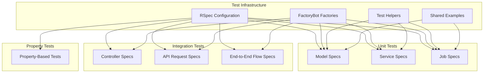
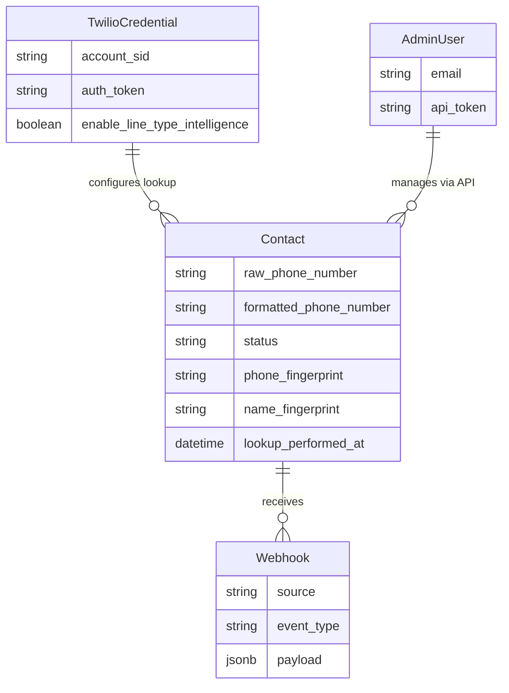

# Design Document: Test Suite Foundation

## Overview

This design establishes a comprehensive test suite for the Twilio Bulk Lookup application, targeting critical path coverage for the components identified in bug reports and the improvement roadmap. The test suite uses RSpec with FactoryBot for unit/integration tests and rspec-property for property-based testing.

The primary goals are:
1. Prevent regression of fixed bugs (race conditions, webhook storms, callback recursion)
2. Establish test infrastructure (factories, shared examples, helpers)
3. Cover critical business logic (status workflow, fingerprinting, circuit breakers)
4. Enable confident refactoring and feature development

## Architecture



## Components and Interfaces

### Test Directory Structure

```
spec/
├── spec_helper.rb              # RSpec configuration
├── rails_helper.rb             # Rails-specific configuration
├── factories/
│   ├── contacts.rb             # Contact factory with traits
│   ├── twilio_credentials.rb   # TwilioCredential factory
│   ├── webhooks.rb             # Webhook factory
│   └── admin_users.rb          # AdminUser factory for API auth
├── support/
│   ├── factory_bot.rb          # FactoryBot configuration
│   ├── database_cleaner.rb     # Database cleaning strategy
│   ├── webmock.rb              # HTTP stubbing configuration
│   ├── shared_examples/
│   │   ├── status_workflow.rb  # Shared status transition tests
│   │   └── circuit_breaker.rb  # Shared circuit breaker tests
│   └── helpers/
│       ├── api_helpers.rb      # API authentication helpers
│       └── job_helpers.rb      # Job testing helpers
├── models/
│   ├── contact_spec.rb         # Contact model specs
│   ├── contact/
│   │   ├── status_workflow_spec.rb
│   │   └── duplicate_detection_spec.rb
│   └── twilio_credential_spec.rb
├── services/
│   ├── circuit_breaker_service_spec.rb
│   ├── business_enrichment_service_spec.rb
│   └── email_enrichment_service_spec.rb
├── jobs/
│   ├── lookup_request_job_spec.rb
│   └── enrichment_coordinator_job_spec.rb
├── controllers/
│   └── webhooks_controller_spec.rb
├── requests/
│   └── api/v1/contacts_spec.rb
├── integration/
│   └── lookup_flow_spec.rb
└── properties/
    ├── contact_properties_spec.rb
    ├── fingerprint_properties_spec.rb
    └── webhook_properties_spec.rb
```

### Key Components

#### 1. Contact Factory (`spec/factories/contacts.rb`)

```ruby
FactoryBot.define do
  factory :contact do
    sequence(:raw_phone_number) { |n| "+1555#{n.to_s.rjust(7, '0')}" }
    formatted_phone_number { raw_phone_number }
    status { 'pending' }

    trait :pending do
      status { 'pending' }
    end

    trait :processing do
      status { 'processing' }
    end

    trait :completed do
      status { 'completed' }
      lookup_performed_at { Time.current }
      carrier_name { 'Verizon' }
      line_type { 'mobile' }
    end

    trait :failed do
      status { 'failed' }
      error_code { '60600' }
      error_message { 'Invalid phone number' }
    end

    trait :with_business do
      business_name { Faker::Company.name }
      business_industry { 'Technology' }
      employee_range { '50-100' }
    end
  end
end
```

#### 2. TwilioCredential Factory (`spec/factories/twilio_credentials.rb`)

```ruby
FactoryBot.define do
  factory :twilio_credential do
    account_sid { "AC#{SecureRandom.hex(16)}" }
    auth_token { SecureRandom.hex(16) }
    enable_line_type_intelligence { true }
    enable_caller_name { true }
  end
end
```

#### 3. API Test Helpers (`spec/support/helpers/api_helpers.rb`)

```ruby
module ApiHelpers
  def api_headers(admin_user = nil)
    admin_user ||= create(:admin_user)
    {
      'Authorization' => "Bearer #{admin_user.api_token}",
      'Content-Type' => 'application/json'
    }
  end
end
```

## Data Models

### Test Data Relationships



## Correctness Properties

*A property is a characteristic or behavior that should hold true across all valid executions of a system-essentially, a formal statement about what the system should do. Properties serve as the bridge between human-readable specifications and machine-verifiable correctness guarantees.*

Based on the prework analysis, the following properties have been identified. Redundant properties have been consolidated.

### Property 1: Status Default Value
*For any* newly created contact, the status field SHALL default to 'pending'.
**Validates: Requirements 1.1**

### Property 2: Valid Status Transitions
*For any* contact in a non-terminal state, valid transitions (pending→processing, processing→completed, processing→failed, failed→pending) SHALL be allowed.
**Validates: Requirements 1.2, 1.3, 1.4, 1.6**

### Property 3: Invalid Status Transitions Rejected
*For any* contact in a terminal state (completed), attempting to transition to a non-terminal state SHALL be rejected with a validation error.
**Validates: Requirements 1.5**

### Property 4: Job Idempotency
*For any* contact that is already completed or processing, LookupRequestJob SHALL skip processing and not make API calls.
**Validates: Requirements 2.2, 2.3**

### Property 5: Race Condition Prevention
*For any* contact processed by concurrent jobs, only one job SHALL successfully acquire the lock and perform the API call.
**Validates: Requirements 2.4**

### Property 6: Fingerprint Determinism
*For any* two contacts with identical phone numbers, the calculated phone fingerprints SHALL be identical.
**Validates: Requirements 3.2, 3.5**

### Property 7: Fingerprint Uniqueness
*For any* two contacts with different phone numbers, the calculated phone fingerprints SHALL be different (with high probability).
**Validates: Requirements 3.3**

### Property 8: Fingerprint Recalculation
*For any* contact whose phone or name fields are updated, the corresponding fingerprint SHALL be recalculated.
**Validates: Requirements 3.1, 3.4**

### Property 9: Singleton Enforcement
*For any* attempt to create a second TwilioCredential record, the creation SHALL be rejected.
**Validates: Requirements 4.2**

### Property 10: Webhook Always Acknowledges
*For any* webhook request (valid, invalid, or error-causing), the controller SHALL return HTTP 200.
**Validates: Requirements 5.1, 5.2, 5.3**

### Property 11: Factory Phone Format Validity
*For any* contact created by FactoryBot, the phone number SHALL match E.164 format.
**Validates: Requirements 6.1**

### Property 12: Factory Credential Format Validity
*For any* TwilioCredential created by FactoryBot, the account_sid SHALL match the AC + 32 hex chars format.
**Validates: Requirements 6.4**

### Property 13: Circuit Breaker State Transitions
*For any* sequence of API calls through CircuitBreakerService, the circuit SHALL open after threshold failures and close after successful recovery.
**Validates: Requirements 7.1, 7.2, 7.3**

### Property 14: Enrichment Error Isolation
*For any* API error in an enrichment service, the error SHALL be logged and the service SHALL return gracefully without raising.
**Validates: Requirements 8.1, 8.2**

### Property 15: Provider Fallback
*For any* enrichment service with multiple providers, failure of one provider SHALL trigger fallback to the next.
**Validates: Requirements 8.4**

### Property 16: Callback Recursion Prevention
*For any* contact update that triggers fingerprint recalculation, the update SHALL use update_columns and not trigger additional callbacks.
**Validates: Requirements 9.1, 9.2**

### Property 17: API Authentication Enforcement
*For any* API request without valid Bearer token, the response SHALL be HTTP 401.
**Validates: Requirements 10.2**

### Property 18: API Phone Validation
*For any* POST request to create a contact, invalid phone formats SHALL be rejected with validation errors.
**Validates: Requirements 10.3**

## Error Handling

### Test Failure Strategies

1. **Flaky Test Prevention**
   - Use `DatabaseCleaner` with transaction strategy for isolation
   - Avoid time-dependent tests; use `Timecop` or `travel_to` when needed
   - Mock external services with `WebMock`

2. **Debugging Support**
   - Enable `--format documentation` for verbose output
   - Use `binding.pry` for interactive debugging
   - Log test context on failure

3. **CI/CD Integration**
   - Run tests in parallel with `parallel_tests` gem
   - Generate JUnit XML reports for CI systems
   - Fail fast on first failure in CI

## Testing Strategy

### Dual Testing Approach

This test suite employs both unit tests and property-based tests:

1. **Unit Tests (RSpec)**
   - Verify specific examples and edge cases
   - Test integration points between components
   - Cover error conditions and boundary values

2. **Property-Based Tests (rspec-property)**
   - Verify universal properties across random inputs
   - Each property test runs minimum 100 iterations
   - Tests are tagged with the correctness property they implement

### Property-Based Testing Framework

The test suite uses `rspec-property` gem for property-based testing:

```ruby
# Gemfile (test group)
gem 'rspec-property', '~> 0.1'
```

### Test Tagging Convention

Each property-based test MUST be tagged with a comment referencing the design document:

```ruby
# **Feature: test-suite-foundation, Property 6: Fingerprint Determinism**
it 'generates identical fingerprints for identical phone numbers' do
  property_of { phone_number }.check(100) do |phone|
    # test implementation
  end
end
```

### Coverage Targets

| Component | Target Coverage |
|-----------|-----------------|
| Contact Model | 90% |
| Status Workflow | 100% |
| LookupRequestJob | 85% |
| CircuitBreakerService | 80% |
| WebhooksController | 90% |
| API v1 Contacts | 85% |

### Test Execution

```bash
# Run all tests
bundle exec rspec

# Run with coverage
COVERAGE=true bundle exec rspec

# Run specific test file
bundle exec rspec spec/models/contact_spec.rb

# Run property tests only
bundle exec rspec --tag property

# Run with documentation format
bundle exec rspec --format documentation
```
