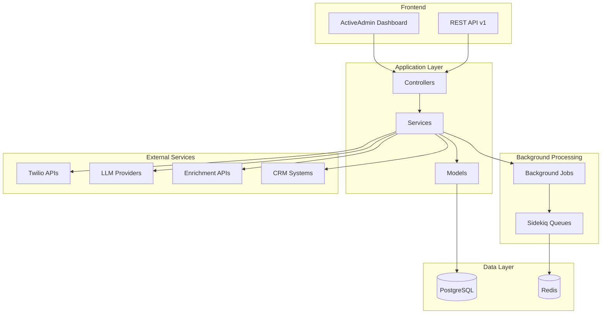
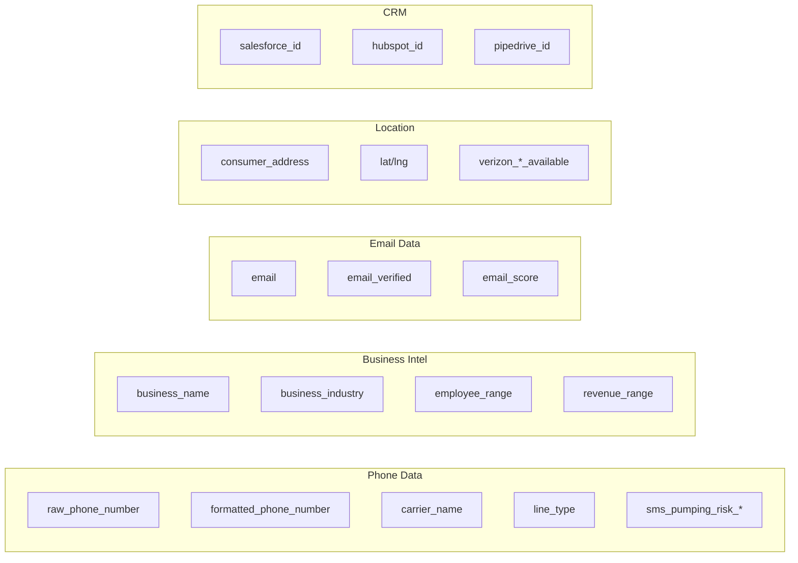
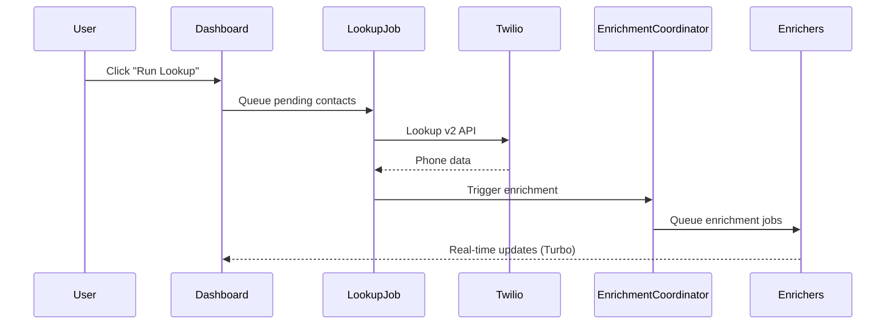

# Bulk Lookup for Twilio — Codebase Overview

> **Last Updated:** December 2024  
> **Rails Version:** 7.2  
> **Ruby Version:** 3.3.5

---

## 📋 Table of Contents

1. [Executive Summary](#executive-summary)
2. [Technology Stack](#technology-stack)
3. [Architecture Overview](#architecture-overview)
4. [Directory Structure](#directory-structure)
5. [Database Schema](#database-schema)
6. [Models](#models)
7. [Services](#services)
8. [Background Jobs](#background-jobs)
9. [Controllers & API](#controllers--api)
10. [Admin Interface](#admin-interface)
11. [External Integrations](#external-integrations)
12. [Configuration](#configuration)
13. [Data Flow](#data-flow)

---

## Executive Summary

**Bulk Lookup for Twilio** is an enterprise-grade contact enrichment platform that transforms raw phone numbers into comprehensive contact profiles. It integrates with **14+ external APIs** to provide:

- **Phone Validation** — Line type, carrier, CNAM lookup
- **Business Intelligence** — Company name, industry, employee count, revenue
- **Email Discovery** — Finding and verifying email addresses
- **Address Enrichment** — Consumer/business addresses with geocoding
- **Fraud Detection** — SMS pumping risk, SIM swap detection
- **AI-Powered Search** — Natural language queries via multi-LLM support
- **CRM Synchronization** — Bidirectional sync with Salesforce, HubSpot, Pipedrive
- **Automated Outreach** — SMS and voice messaging via Twilio

---

## Technology Stack

| Layer | Technology |
|-------|------------|
| **Framework** | Ruby on Rails 7.2 |
| **Language** | Ruby 3.3.5 |
| **Database** | PostgreSQL |
| **Background Jobs** | Sidekiq with Redis |
| **Admin Interface** | ActiveAdmin |
| **Real-time Updates** | Turbo Streams (Hotwire) |
| **Authentication** | Devise |
| **AI/LLM** | OpenAI GPT, Anthropic Claude, Google Gemini |
| **Messaging** | Twilio SMS & Voice |
| **Geocoding** | Google Geocoding API |
| **Deployment** | Heroku, Render, Docker |

---

## Architecture Overview



---

## Directory Structure

```
twilio-bulk-lookup-master/
├── app/
│   ├── admin/                    # ActiveAdmin dashboard configurations
│   │   ├── admin_users.rb        # Admin user management
│   │   ├── ai_assistant.rb       # AI-powered search interface
│   │   ├── api_connectors.rb     # API integration dashboard
│   │   ├── api_health.rb         # API health monitoring
│   │   ├── business_lookup.rb    # Zipcode business discovery
│   │   ├── circuit_breakers.rb   # Circuit breaker status
│   │   ├── contacts.rb           # Contact management (40KB)
│   │   ├── dashboard.rb          # Main dashboard (29KB)
│   │   ├── duplicates.rb         # Duplicate detection UI
│   │   ├── twilio_credentials.rb # Settings & configuration (48KB)
│   │   └── zipcode_lookups.rb    # Zipcode lookup history
│   │
│   ├── controllers/
│   │   ├── api/v1/               # REST API endpoints
│   │   │   └── contacts_controller.rb
│   │   ├── health_controller.rb  # K8s health probes
│   │   ├── lookup_controller.rb  # Bulk lookup trigger
│   │   └── webhooks_controller.rb# Incoming webhooks
│   │
│   ├── jobs/                     # Sidekiq background jobs
│   │   ├── lookup_request_job.rb         # Main phone lookup
│   │   ├── business_enrichment_job.rb    # Business data
│   │   ├── email_enrichment_job.rb       # Email discovery
│   │   ├── address_enrichment_job.rb     # Address lookup
│   │   ├── geocoding_job.rb              # Coordinate mapping
│   │   ├── verizon_coverage_check_job.rb # Coverage check
│   │   ├── trust_hub_enrichment_job.rb   # Trust Hub verification
│   │   ├── duplicate_detection_job.rb    # Deduplication
│   │   ├── crm_sync_job.rb               # CRM synchronization
│   │   └── enrichment_coordinator_job.rb # Orchestration
│   │
│   ├── models/
│   │   ├── concerns/
│   │   │   ├── contact/
│   │   │   │   ├── business_intelligence.rb
│   │   │   │   ├── duplicate_detection.rb
│   │   │   │   ├── enrichment_tracking.rb
│   │   │   │   ├── phone_intelligence.rb
│   │   │   │   ├── trust_hub_verification.rb
│   │   │   │   └── verizon_coverage.rb
│   │   │   ├── error_trackable.rb
│   │   │   └── status_manageable.rb
│   │   ├── contact.rb            # Core contact model
│   │   ├── admin_user.rb         # Devise admin user
│   │   ├── twilio_credential.rb  # Configuration singleton
│   │   ├── api_usage_log.rb      # API cost tracking
│   │   ├── webhook.rb            # Incoming webhooks
│   │   ├── zipcode_lookup.rb     # Business discovery records
│   │   └── dashboard_stats.rb    # Materialized view model
│   │
│   ├── services/                 # Business logic layer
│   │   ├── multi_llm_service.rb          # AI provider abstraction
│   │   ├── business_lookup_service.rb    # Google/Yelp integration
│   │   ├── business_enrichment_service.rb
│   │   ├── email_enrichment_service.rb   # Hunter.io, ZeroBounce
│   │   ├── address_enrichment_service.rb # Whitepages, TrueCaller
│   │   ├── geocoding_service.rb          # Google Geocoding
│   │   ├── verizon_coverage_service.rb   # Coverage checking
│   │   ├── trust_hub_service.rb          # Twilio Trust Hub
│   │   ├── messaging_service.rb          # SMS & Voice
│   │   ├── duplicate_detection_service.rb
│   │   ├── circuit_breaker_service.rb    # Stoplight integration
│   │   ├── ai_assistant_service.rb       # AI search parsing
│   │   ├── parallel_enrichment_service.rb
│   │   ├── error_tracking_service.rb
│   │   ├── prompt_sanitizer.rb           # LLM input sanitization
│   │   └── crm_sync/
│   │       ├── salesforce_service.rb
│   │       ├── hubspot_service.rb
│   │       └── pipedrive_service.rb
│   │
│   └── views/                    # View templates
│
├── config/
│   ├── routes.rb                 # Application routes
│   ├── sidekiq.yml               # Sidekiq configuration
│   ├── database.yml              # PostgreSQL settings
│   └── initializers/             # Rails initializers
│
├── db/
│   ├── migrate/                  # 45 migrations
│   └── schema.rb                 # Current schema
│
└── spec/                         # RSpec test suite
```

---

## Database Schema

### Core Tables

| Table | Purpose | Key Fields |
|-------|---------|------------|
| `contacts` | Central contact records | 150+ columns covering phone, business, email, address, CRM, messaging |
| `twilio_credentials` | Configuration singleton | API keys, feature toggles, thresholds |
| `api_usage_logs` | Cost tracking per API call | provider, cost, response_time_ms |
| `webhooks` | Incoming webhook events | source, event_type, payload |
| `zipcode_lookups` | Business discovery history | zipcode, status, businesses_found |
| `admin_users` | Admin authentication | email, api_token |

### Contact Model — Field Groups



### Database Constraints

The schema includes:
- **Check constraints** for status enums and score ranges
- **Unique indexes** on CRM IDs and phone fingerprints
- **Composite indexes** for common query patterns
- **Partial indexes** for null-filtered lookups

---

## Models

### Contact (`app/models/contact.rb`)

The central model with **150+ fields** organized via concerns:

| Concern | Purpose |
|---------|---------|
| `Contact::BusinessIntelligence` | Company data scopes & helpers |
| `Contact::PhoneIntelligence` | Phone validation & risk methods |
| `Contact::EnrichmentTracking` | Enrichment status & timestamps |
| `Contact::VerizonCoverage` | Coverage availability methods |
| `Contact::TrustHubVerification` | Trust Hub status helpers |
| `Contact::DuplicateDetection` | Fingerprinting & dedup logic |
| `ErrorTrackable` | Error handling utilities |
| `StatusManageable` | Status workflow (pending → processing → completed/failed) |

**Key Methods:**
- `mark_processing!` / `mark_completed!` / `mark_failed!`
- `lookup_completed?` / `retriable?` / `permanent_failure?`
- `broadcast_status_update` — Turbo Stream real-time updates
- `recalculate_bulk_metrics` — Batch fingerprint recalculation

### TwilioCredential (`app/models/twilio_credential.rb`)

Singleton configuration model with:
- API credentials (Twilio, Clearbit, Hunter.io, OpenAI, etc.)
- Feature toggles (`enable_*` booleans)
- Threshold settings (confidence scores, rate limits)
- CRM sync configuration

### ApiUsageLog (`app/models/api_usage_log.rb`)

Tracks every external API call:
- Provider, service, endpoint
- Cost (decimal), credits used
- Response time, HTTP status
- Request/response data (JSONB)

---

## Services

### Multi-LLM Service (`app/services/multi_llm_service.rb`)

Abstracts AI provider access:

```ruby
# Usage
service = MultiLlmService.new
result = service.generate("Summarize this contact", options)
filters = service.parse_query("Find tech companies in California")
intel = service.generate_sales_intelligence(contact)
message = service.generate_outreach_message(contact, message_type: 'intro')
```

**Supported Providers:**
- OpenAI (`gpt-4o-mini`, `gpt-4`)
- Anthropic (`claude-3-5-sonnet`)
- Google AI (`gemini-1.5-flash`)

### Business Lookup Service (`app/services/business_lookup_service.rb`)

Discovers businesses by zipcode:

```ruby
service = BusinessLookupService.new(zipcode, zipcode_lookup: record)
service.lookup_businesses(limit: 20)
```

**Provider Cascade:**
1. Google Places (new API)
2. Google Places (legacy API)
3. Yelp Fusion

### Circuit Breaker Service (`app/services/circuit_breaker_service.rb`)

Protects external API calls using the **Stoplight** gem:

```ruby
CircuitBreakerService.call(:twilio) do
  # API call here
end

state = CircuitBreakerService.state(:twilio)  # :green, :yellow, :red
CircuitBreakerService.reset(:twilio)          # Force close circuit
```

### CRM Sync Services (`app/services/crm_sync/`)

| Service | Purpose |
|---------|---------|
| `SalesforceService` | OAuth, contact push/pull, field mapping |
| `HubspotService` | Contact sync, deal/company linking |
| `PipedriveService` | Person/organization sync |

---

## Background Jobs

All jobs use **Sidekiq** with exponential backoff retry:

| Job | Purpose | Trigger |
|-----|---------|---------|
| `LookupRequestJob` | Core Twilio Lookup v2 API call | Dashboard "Run Lookup" |
| `BusinessEnrichmentJob` | Clearbit/NumVerify enrichment | After phone lookup |
| `EmailEnrichmentJob` | Hunter.io/ZeroBounce | After business enrichment |
| `AddressEnrichmentJob` | Whitepages/TrueCaller | For consumer contacts |
| `GeocodingJob` | Convert address to lat/lng | After address enrichment |
| `VerizonCoverageCheckJob` | Check 5G/LTE availability | After geocoding |
| `TrustHubEnrichmentJob` | Twilio Trust Hub verification | For businesses |
| `DuplicateDetectionJob` | Find duplicate contacts | After any enrichment |
| `CrmSyncJob` | Push/pull from CRMs | Scheduled or on-demand |
| `EnrichmentCoordinatorJob` | Orchestrate enrichment pipeline | After phone lookup |
| `DashboardBroadcastJob` | Throttled Turbo Stream updates | Contact status changes |

### Job Configuration (`config/sidekiq.yml`)

```yaml
:concurrency: 5           # 2 dev, 10 prod
:timeout: 30
:max_retries: 3
:queues:
  - [default, 2]
  - [mailers, 1]
```

---

## Controllers & API

### Routes (`config/routes.rb`)

```
/                      → /admin (redirect)
/admin                 → ActiveAdmin dashboard
/sidekiq               → Sidekiq Web UI (authenticated)
/lookup                → Trigger bulk lookup

/api/v1/contacts       → REST API
  GET    /             → List contacts (paginated)
  GET    /:id          → Single contact
  POST   /             → Create contact for lookup

/webhooks/twilio/sms_status   → SMS delivery status
/webhooks/twilio/voice_status → Voice call status
/webhooks/twilio/trust_hub    → Trust Hub events
/webhooks/generic             → Generic webhook receiver

/health                → Liveness probe
/health/ready          → Readiness probe
/health/detailed       → Full health report
```

### Health Controller

Kubernetes-compatible health probes checking:
- PostgreSQL connectivity
- Redis connectivity
- Sidekiq queue depth
- Memory usage

---

## Admin Interface

Built with **ActiveAdmin**, the dashboard provides:

### Main Dashboard (`app/admin/dashboard.rb`)
- Contact statistics (pending, processing, completed, failed)
- Processing rate and queue depth
- Recent activity feed
- Quick action buttons

### Contacts (`app/admin/contacts.rb`)
- Filterable/searchable contact list
- Batch actions (bulk lookup, export)
- Detailed contact view with all fields
- Import/export (CSV, TSV, Excel)

### API Connectors (`app/admin/api_connectors.rb`)
- Visual status of all 14+ integrations
- Connection health checks
- Usage statistics per provider

### AI Assistant (`app/admin/ai_assistant.rb`)
- Natural language search interface
- Query parsing via selected LLM
- Contact filtering results

### Twilio Credentials (`app/admin/twilio_credentials.rb`)
- API key management
- Feature toggles
- Threshold configuration
- CRM OAuth flows

---

## External Integrations

### Phone Validation
| Provider | Data |
|----------|------|
| **Twilio Lookup v2** | Line type, carrier, CNAM, risk scores |

### Business Intelligence
| Provider | Data |
|----------|------|
| **Clearbit** | Company domain, employee count, revenue, tech stack |
| **NumVerify** | Basic phone intelligence |

### Email Discovery
| Provider | Data |
|----------|------|
| **Hunter.io** | Email finding from domain |
| **ZeroBounce** | Email verification |

### Address & Location
| Provider | Data |
|----------|------|
| **Whitepages Pro** | Consumer address lookup |
| **TrueCaller** | Alternative address source |
| **Google Geocoding** | Address → coordinates |
| **Verizon** | 5G/LTE coverage availability |

### Business Discovery
| Provider | Data |
|----------|------|
| **Google Places** | Businesses by location |
| **Yelp Fusion** | Business directory fallback |

### AI/LLM
| Provider | Use Case |
|----------|----------|
| **OpenAI** | Query parsing, sales intelligence |
| **Anthropic Claude** | Advanced reasoning |
| **Google Gemini** | Cost-effective generation |

### CRM
| Provider | Sync Type |
|----------|-----------|
| **Salesforce** | Bidirectional OAuth |
| **HubSpot** | API key sync |
| **Pipedrive** | API key sync |

### Messaging
| Provider | Capability |
|----------|------------|
| **Twilio SMS** | Outbound messages, delivery webhooks |
| **Twilio Voice** | Outbound calls, status webhooks |

### Trust & Verification
| Provider | Capability |
|----------|------------|
| **Twilio Trust Hub** | Business identity verification |

---

## Configuration

### Environment Variables

```bash
# Required
TWILIO_ACCOUNT_SID=ACxxxxxxxx
TWILIO_AUTH_TOKEN=xxxxxxxx
DATABASE_URL=postgres://...
REDIS_URL=redis://localhost:6379/0
RAILS_MASTER_KEY=xxxxxxxx

# Optional enrichment APIs
CLEARBIT_API_KEY=sk-xxxxxxxx
HUNTER_API_KEY=xxxxxxxx
OPENAI_API_KEY=sk-xxxxxxxx
ANTHROPIC_API_KEY=sk-ant-xxxxxxxx
GOOGLE_PLACES_API_KEY=AIzaxxxxxxxx
```

### Feature Toggles

All managed via `TwilioCredential` singleton:

| Toggle | Default | Purpose |
|--------|---------|---------|
| `enable_line_type_intelligence` | true | Phone type detection |
| `enable_caller_name` | true | CNAM lookup |
| `enable_sms_pumping_risk` | true | Fraud detection |
| `enable_business_enrichment` | true | Company data |
| `enable_email_enrichment` | true | Email discovery |
| `enable_duplicate_detection` | true | Deduplication |
| `enable_ai_features` | true | OpenAI integration |
| `enable_geocoding` | false | Address coordinates |
| `enable_verizon_coverage_check` | false | Coverage lookup |
| `enable_trust_hub` | false | Trust Hub verification |
| `enable_salesforce_sync` | false | Salesforce CRM |
| `enable_hubspot_sync` | false | HubSpot CRM |
| `enable_sms_messaging` | false | SMS outreach |
| `enable_voice_messaging` | false | Voice calls |

---

## Data Flow

### Phone Lookup Pipeline



### Enrichment Cascade

```
Contact Created
    ↓
LookupRequestJob (Twilio Lookup v2)
    ↓
EnrichmentCoordinatorJob
    ├── BusinessEnrichmentJob (if is_business)
    │       ↓
    │   EmailEnrichmentJob (if has domain)
    │       ↓
    │   TrustHubEnrichmentJob (if verified)
    │
    ├── AddressEnrichmentJob (if consumer)
    │       ↓
    │   GeocodingJob (if has address)
    │       ↓
    │   VerizonCoverageCheckJob (if has coordinates)
    │
    └── DuplicateDetectionJob (always)
            ↓
        CrmSyncJob (if enabled)
```

---

## Performance Considerations

### Processing Throughput

| Operation | Rate | Notes |
|-----------|------|-------|
| Phone Lookup | ~4,000/hour | Twilio rate limits apply |
| Business Enrichment | ~2,000/hour | Clearbit rate limits |
| Email Discovery | ~1,500/hour | Hunter.io limits |
| Business Discovery | ~20/zipcode | Google Places pagination |

### Optimization Features

- **Bulk import callbacks bypass** — Thread-local flag skips expensive callbacks
- **Throttled Turbo broadcasts** — 1/second max to prevent Redis flooding
- **Partial indexes** — Optimized queries for common filters
- **Materialized view** — `DashboardStats` for aggregate queries
- **Circuit breakers** — Prevent cascading failures from API outages

---

## Testing

```bash
# Run full suite
bundle exec rspec

# Run with coverage
COVERAGE=true bundle exec rspec

# Specific specs
bundle exec rspec spec/models/contact_spec.rb
bundle exec rspec spec/services/circuit_breaker_service_spec.rb
```

---

## Deployment

### Heroku

```bash
heroku create your-app
heroku addons:create heroku-postgresql:mini
heroku addons:create heroku-redis:mini
heroku config:set TWILIO_ACCOUNT_SID=ACxxx TWILIO_AUTH_TOKEN=xxx
git push heroku main
heroku run rails db:migrate db:seed
```

### Render

Use `render.yaml` for infrastructure-as-code deployment.

### Docker

```bash
docker-compose up
```

---

## Security

- **API credentials encrypted** — Rails credentials or environment variables
- **Admin authentication** — Devise with session management
- **API authentication** — Bearer tokens per admin user
- **Input sanitization** — `PromptSanitizer` for LLM inputs
- **CSRF protection** — Rails default for forms
- **Webhook validation** — Signature verification for Twilio

---

*This document was generated from codebase analysis on December 16, 2024.*
